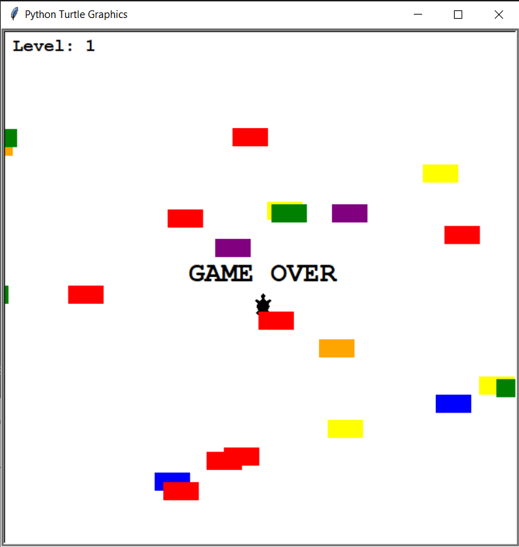

# Turtle Race Game

A simple turtle-race game where the player navigates a turtle across the screen
while avoiding oncoming cars. Built with Python's Turtle graphics module and OOP principles.

## Description

You control a turtle that starts at the bottom of the screen and tries to reach the top.
Cars of random colors and positions move from right to left.
Each time the turtle successfully crosses, the game level increases and cars move faster.
If the turtle collides with a car, the game ends.

## Features

- **Dynamic difficulty**
- **Collision detection**
- **Scoreboard**

## Technologies Used

- **Python 3.12.2**
- **'turtle'**

## File Overview

- **main.py** – entry point; sets up screen, game loop, and event listeners
- **player.py** – defines `Player` class (turtle movement, start/finish logic)
- **car_manager.py** – defines `CarManager` class (car creation, movement, speed control)
- **scoreboard.py** – defines `Scoreboard` class (level display, game over)

